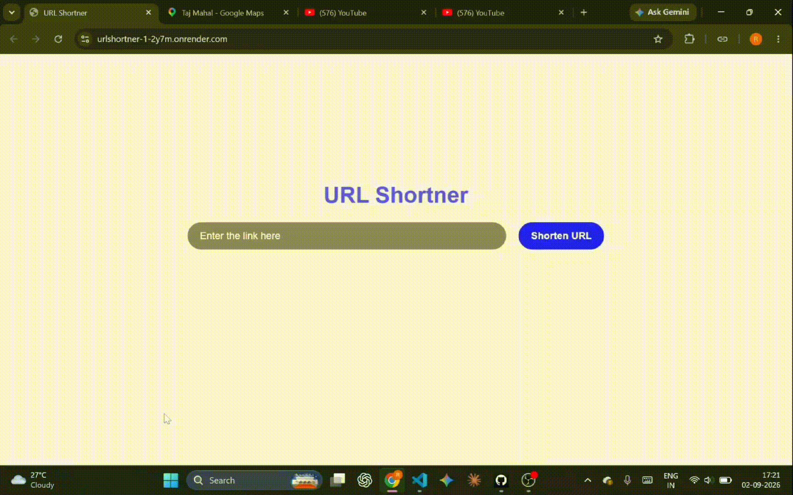

# URL Shortener

A full-stack URL shortener built with the MERN stack. Paste in a long link, get back a short, shareable one — click it, and you're redirected to the original destination.



## Features

- Shorten any valid `http`/`https` URL into a compact link
- Duplicate-safe: shortening the same URL twice returns the existing short link instead of creating a new one
- One-click copy of the generated short URL
- Rate limiting, HTTP header hardening, and HTTP parameter pollution protection on the API
- Responsive UI with animated feedback (loading state, error messages, copy confirmation)

## Tech Stack

**Frontend**

- React (Vite)
- Tailwind CSS
- Motion (Framer Motion) for animations

**Backend**

- Node.js / Express
- MongoDB with Mongoose
- [`nanoid`](https://www.npmjs.com/package/nanoid) for generating short codes
- [`validator`](https://www.npmjs.com/package/validator) for URL validation
- `helmet`, `cors`, `hpp`, and `express-rate-limit` for API security

## Project Structure

```
URLshortner/
├── app/                      # Frontend (React + Vite)
│   ├── public/
│   ├── src/
│   │   ├── assets/
│   │   ├── App.jsx
│   │   ├── index.css
│   │   └── main.jsx
│   ├── index.html
│   ├── package.json
│   └── vite.config.js
│
├── controllers/
│   └── apiControllers.js     # Route handlers: create + resolve short links
├── models/
│   └── Model.js               # Mongoose schema (link, short)
├── routes/
│   └── apiRoutes.js           # /  and  /:link routes
│
├── app.js                     # Express app: middleware, CORS, routes, error handler
├── server.js                  # DB connection + server bootstrap
├── config.env                 # Environment variables (not committed)
├── package.json
└── .gitignore
```

## Getting Started

### Prerequisites

- Node.js (v18+ recommended)
- A MongoDB database (e.g. a free MongoDB Atlas cluster)

### 1. Clone the repo

```bash
git clone <your-repo-url>
cd URLshortner
```

### 2. Backend setup

Install dependencies from the project root:

```bash
npm install
```

Create a `config.env` file in the root directory:

```env
PORT=8000
MONGODB_URI=mongodb+srv://<db_username>:<db_password>@your-cluster.mongodb.net/your-db
MONGODB_USERNAME=your_mongodb_username
MONGODB_PASSWORD=your_mongodb_password
FRONTEND_ORIGIN=http://localhost:5173
```

Start the server:

```bash
node server.js
```

The API will run on `http://localhost:8000` (or the `PORT` you set).

### 3. Frontend setup

In a separate terminal:

```bash
cd app
npm install
```

Create a `.env` file inside `app/`:

```env
VITE_API_URL=http://localhost:8000
```

Start the dev server:

```bash
npm run dev
```

## API Reference

| Method | Endpoint      | Description                                                                          |
| ------ | ------------- | ------------------------------------------------------------------------------------ |
| `POST` | `/?url=<url>` | Shortens the given URL. Returns the existing entry if the URL was already shortened. |
| `GET`  | `/:link`      | Redirects to the original URL for a given short code.                                |
| `GET`  | `/health`     | Health check — returns `{ status: "ok" }`.                                           |

**Example response (`POST /?url=https://example.com`):**

```json
{
  "status": "success",
  "data": {
    "_id": "...",
    "link": "https://example.com",
    "short": "aZ3kD9pQ1x"
  }
}
```

## Security Notes

- URLs are validated (`http`/`https` only, max 2048 chars) before a short link is created
- Requests are rate-limited to 100 per hour per client
- CORS is restricted to an allow-list of origins
- `helmet` and `hpp` add baseline protection against common HTTP-level attacks

## Deployment / Live Demo

This project was built using the MERN stack and deployed with Render.

**Live:** [urlshortner-1-2y7m.onrender.com](https://urlshortner-1-2y7m.onrender.com/) _(may not be live — see note below)_

> **Heads up:** the backend will be taken offline in the next few days. Right now there's no check in place to catch malicious or phishing URLs before they're shortened, so leaving the API publicly reachable isn't safe long-term. That kind of protection (URL reputation / safe-browsing checks) is planned for a future update — once it's in, the backend will go back up.
